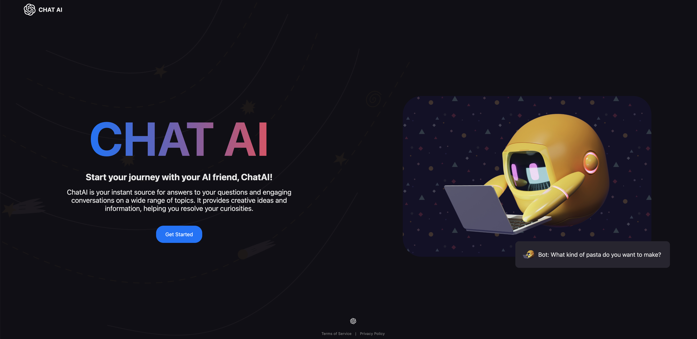
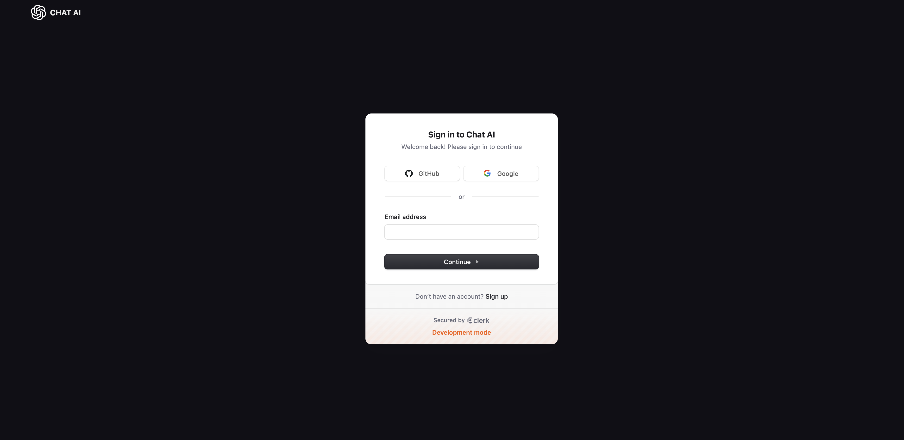
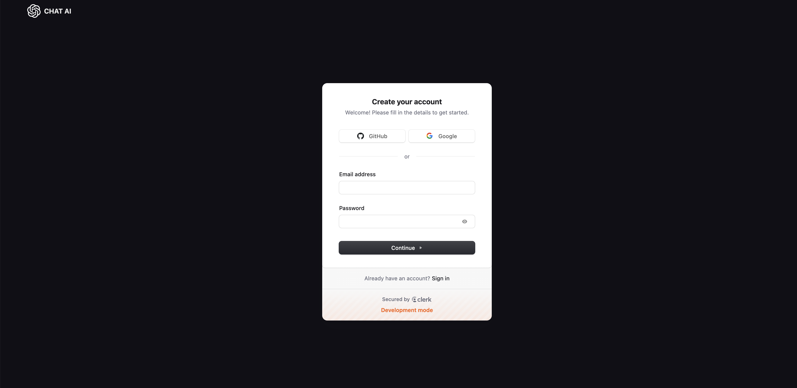
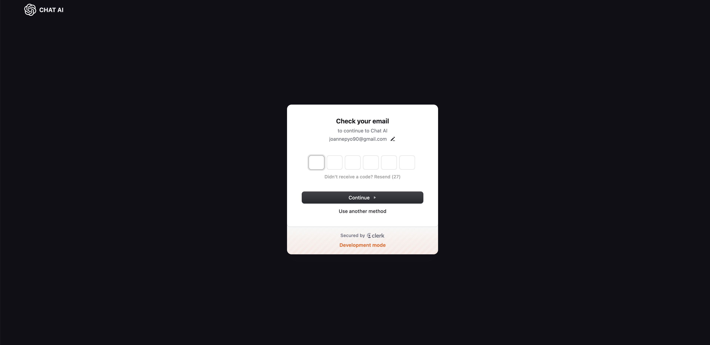
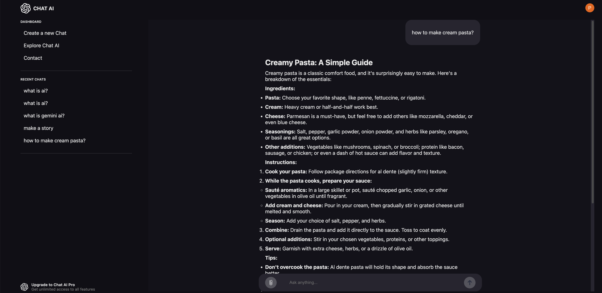
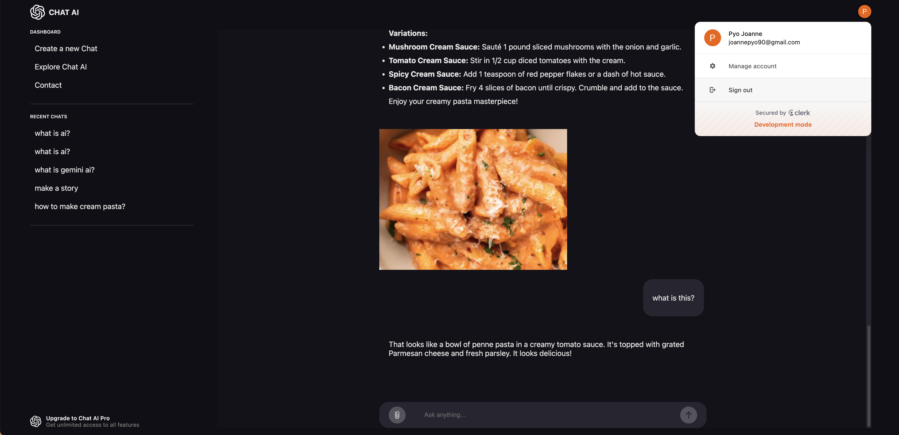

# ChatAI

## Introduction

ChatAI is a free full-stack ChatGPT application built using **React JS**, **Express**, **MongoDB**, and **Google Gemini AI**. Users can ask questions and attach photos.

**React JS** is a JavaScript library for building user interfaces (UIs) that allows developers to create UI components that are reusable and organized. In ChatAI, React is used to create dynamic web pages and facilitate user interactions smoothly. Additionally, it manages the application's data flow efficiently through state management.

**Express** is a web application framework for Node.js that simplifies the process of writing server-side logic. The backend of ChatAI uses Express to build a Restful API and handle client requests. This framework provides various features such as routing, middleware, and request/response handling, making server development easier.

**MongoDB** is a NoSQL database that stores data in a JSON-like format. ChatAI utilizes MongoDB to store user information, questions, and answers. This database offers flexibility and scalability, allowing for efficient management of various data types. The application employs Mongoose, an Object Data Modeling (ODM) library, to facilitate interactions with MongoDB.

Lastly, **Google Gemini AI** leverages Google's artificial intelligence technology to support natural language processing (NLP) and question-answering systems. ChatAI uses this AI to generate answers to user questions, providing a more natural conversational experience. Gemini AI's advanced algorithms help understand user intent and deliver appropriate responses.

Through this technology stack, ChatAI provides users with an intuitive and efficient chatting experience. Users can input questions, receive answers, and attach photos to enrich the interaction.

## How to Use

1. **Start the Site**: Open the website to display the initial screen.

2. **Login**: Click the "Get Started" button to navigate to the login screen. You can log in using either your GitHub or Google account.

3. **Sign Up**: You can create a new account on the "Sign Up" page. After creating an account, enter your email address to receive a verification code automatically.

4. **Verification**: Enter the verification code sent to your email to access the ChatAI page.

5. **Ask Questions**: On the ChatAI page, you can input questions and receive answers. The feature to attach photos is also supported.

## Features

- **Question Submission**: Users can input questions and receive answers.
- **Photo Attachment**: Users can attach photos along with their questions.

## Conclusion

ChatAI aims to provide a seamless and engaging user experience by combining advanced AI capabilities with a user-friendly interface. Whether you're looking for quick answers or in-depth discussions, ChatAI is designed to meet your needs. We believe that technology should empower users, and with ChatAI, you can explore the world of information at your fingertips. Your feedback and contributions are invaluable as we continue to improve and expand this application. Thank you for using ChatAI!

